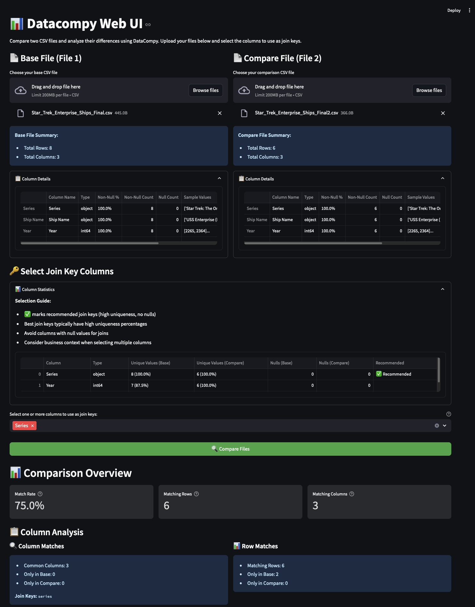

# Datacompy Web UI

A web interface for comparing CSV files using [Datacompy](https://capitalone.github.io/datacompy/). Built with [Streamlit](https://streamlit.io/).



## Features

- Upload and compare two CSV files
- Smart join key recommendations
- Interactive visualization of differences
- Detailed column-by-column analysis
- Row-level comparison with mismatches highlighted

## Installation

### Recommended (using pipx)

```bash
# Install pipx if you haven't already
brew install pipx
pipx ensurepath

# Install DataCompy Web UI
pipx install git+https://github.com/mahangu/datacompy-web-ui.git
```

### Alternative (using pip)

```bash
pip install git+https://github.com/mahangu/datacompy-web-ui.git
```

### Upgrading

To upgrade to the latest version:

```bash
# Using pipx (recommended)
pipx upgrade datacompy-web-ui

# Or force reinstall from git
pipx install --force git+https://github.com/mahangu/datacompy-web-ui.git
```

### For Development

1. Clone the repository:
```bash
git clone https://github.com/mahangu/datacompy-web-ui.git
cd datacompy-web-ui
```

2. Install development dependencies:
```bash
make install
```

## Usage

### Command Line

After installation, run:
```bash
datacompy-web-ui
```

This will start the Streamlit server and open the UI in your default browser.

### Development Mode

```bash
make run
```

## Development

### Setup

```bash
make install
```

### Running Tests

```bash
make test
```

### Clean Build Files

```bash
make clean
```

## Contributing

1. Fork the repository
2. Create your feature branch (`git checkout -b feature/amazing-feature`)
3. Commit your changes (`git commit -m 'Add some amazing feature'`)
4. Push to the branch (`git push origin feature/amazing-feature`)
5. Open a Pull Request

## License

This project is licensed under the GNU General Public License v2 (GPLv2). 